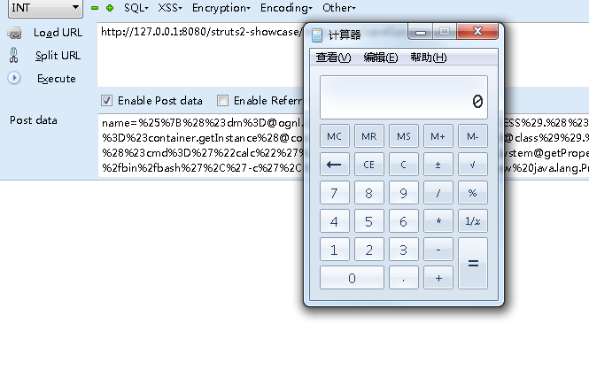
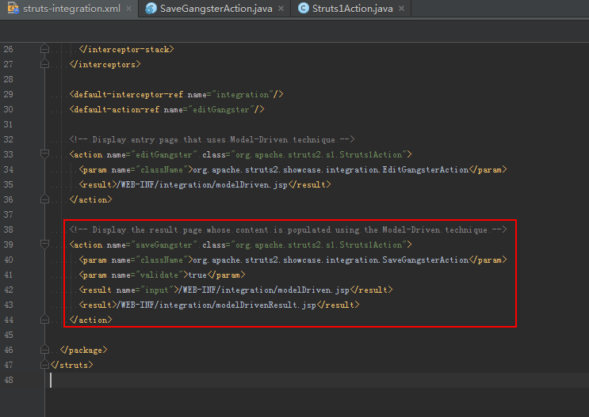
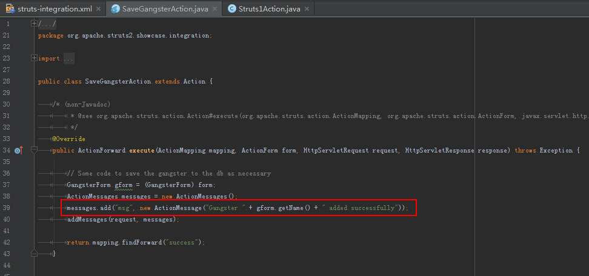

# Struts2远程代码执行（S2-048）漏洞分析

<small>* 主要是跟实验室的小伙伴们分享一下此类漏洞出现时如何去快速的跟踪复现和分析，包括之前的S2-045也一样。</small>

## 漏洞编号

CVE-2017-9791

## 快速复现

- 收到漏洞预警后，先仔细阅读漏洞描述，里面通常情况下会对影响的功能模块、方法函数有一个大致介绍，可以给我们圈定一个范围
- 其次是影响版本，如果开源，直接把修复前后两个版本下载下来准备做对比，但是至少要下载当前影响版本，搭建测试环境

在S2-048这个预警的漏洞描述 *（360安全客）* 中，开以很清楚的看到两个信息点：

> 当Struts 2中的Struts 1插件启用的情况下，攻击者通过使用恶意字段值可能造成RCE。这些不可信的输入数据被带入到ActionMessage类中的错误信息中。

然后给出了临时解决方案，这是一个非常重要的信息获取点，临时解决方案一般就意味着有希望直接定位漏洞入口：

> 开发者通过使用resource keys替代将原始消息直接传递给ActionMessage的方式：
> `messages.add("msg", new ActionMessage("struts1.gangsterAdded", gform.getName()));`
> 一定不要使用如下的方式：
> `messages.add("msg", new ActionMessage("Gangster " + gform.getName() + " was added"));`

现在可以很清楚的知道，漏洞点就是在上面这句话的中，在没有更多信息的情况下，就需要对`ActionMessage`做代码审计来进一步分析。

别急，360还很贴心的给出了一个验证截图，我就不贴出来了。

仔细看截图的URL，里面可以很清楚的看到，项目名称struts2-showcase，这是Struts2完整包中自带的示例项目，那就可以去这个项目中全局搜索缩小范围了。

再仔细看看，URL项目路径后面还可以勉强辨认出第一个字符i，前4-5个字符是g或j，好运气，直接定位integration项目，再搜索分析，范围基本确定在SaveGangsterAction中了。

看到这里别笑，能够先完成复现再去跟踪调试分析漏洞成因是相当有优势的，快速复现求的是速度，和CTF一样，拼的就是对分析对象的熟悉程度、分析经验和脑洞。

访问integration项目是一个表单，提交到/saveGangster.action，就它了，代码里也可以很明显的确定可控参数是`name`。

那让我们再开一个脑洞，之前漏洞描述中标出的第二个重要信息有后半句，错误信息，很快的可以联想到S2-045，凭经验可以猜想应该又和OGNL表达式有关，Java能够RCE的就那么几种场景：可解析的表达式、反序列化、反射、直接编写的相关功能等，而Struts2更多的喜欢使用OGNL来处理，已经爆过很多与OGNL相关的洞了。

那就开始注入。

提到注入，大多数情况下只有两种情况，一个是直接注入，另一个是闭合绕过注入，大家就理解为一个是where的sql注入，另一个是where id=的sql注入吧。

我们不管三七二十一，先拿S2-045的Payload来试试，它是一个完整的OGNL表达式 *（除了第一个变量赋值语句，为了成功进入multipart流程，可删）* ，符合第一种情况。

下图的结果很明显是成功的。

## 漏洞分析

在struts-integration.xml配置文件中，可以看到SaveGangsterAction是被org.apache.struts2.s1.Struts1Action做了包装修饰。

而Struts1Action的`execute()`方法中，在第99行调用了SaveGangsterAction的`execute()`方法执行真正的业务逻辑。

而在第105行判断当前的actionMessage对象是否有value属性，答案当然是没有 *（所以临时修复建议是将传参由单独传一个拼接的key，改为传两个，即key和value）* ，因此跳转到第108行继续执行，其中`getText()`方法和S2-045中的`findText()`方法类似，都会解析OGNL表达式，导致漏洞被触发，就不继续往里跟了。

至此，该漏洞利用条件为：

1. 使用了struts2-struts1-plugin插件
1. 在被Struts1Action包装的action中将用户可控的参数为key值设置到了ActionMessage中

值得注意的是，该漏洞从黑盒的角度来看特征比较模糊，可以依靠对action传参的fuzz来进行检测。