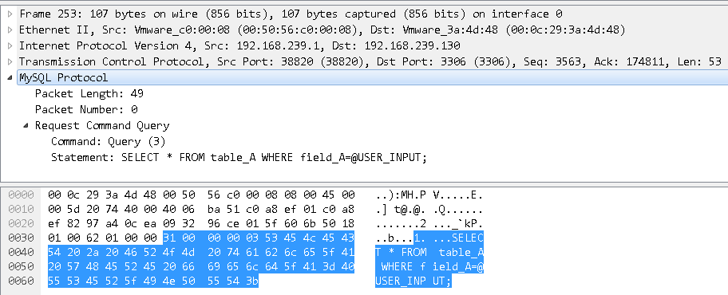

# SQL和NoSQL注入浅析（上）


<sub>* 前段时间听到几位大佬对NoSQL注入相关问题进行了热烈的讨论，于是事后做了一些简单了解。本文纯属个人扯淡，与技术无关。行文仓促，如有任何问题欢迎指正。</sub>

## 说在前面的话

这篇文章不是为了告诉大家如何挖掘SQL注入漏洞或SQL注入相关的实战技巧，我相信能够看完这篇文章的同学在实战能力和经验上一定比我强很多。撰写本文的目的也仅仅是自己突然无聊的想从多个层面去了解更多关于SQL注入，或者说是SQL语句执行本身相关的细节内容，让自己更清晰的理解SQL注入的原理和本质，以及期待在分析过程中发生一些意外的思维碰撞。

那让我们开始吧。

## 关系型数据库SQL注入

不用多说，提到SQL注入，我们首先想到的肯定是传统关系型数据库中最常见的`1 or 1=1`和`' or ''='`。

基本原理不用再细述了，就是大家都知道的：程序在构造SQL语句时，没有考虑输入数据的合法性，当数据内容超出预期时，影响了SQL语句原有的结构和语义，产生注入等安全问题。

主流的修复方案也很简单，过滤特殊字符、转义特殊字符、预处理等等。哪个方案更好更合理，是否应该全局处理，通过AOP、装饰还是数据库操作基类处理，这都不是本文的重点，不做过多讨论。

我们只再多问自己一句废话，为什么会这样？换个说法，为什么输入的数据会影响SQL语句的结构和语义 *（貌似还是废话）* ？

假设我们的SQL长这样：

```sql
SELECT * FROM table_A WHERE field_A=@USER_INPUT
```

它从构造到执行，一般会涉及以下几个阶段：

> 客户端应用 => 客户端驱动 => 数据库客户端/服务器协议 => 数据库服务器

为了便于分析，我们重新排个序：

- 客户端/服务器协议
- 服务器协议实现
- 服务器解析执行实现
- 客户端协议实现（Driver层）
- 客户端应用实现

借用开源关系型数据库MySQL *（本文选择MySQL在Github上的默认branch 5.7版本，不同版本或其他语言驱动和数据库可能有区别）* ，我们来具体看一下上面那条最简单的SQL查询语句在各阶段的情况 *（服务器对于不同的Command指令也可能会有不同的处理方式，甚至一些其他的中间处理过程也会形成攻击面，这里以思路为主，不详细展开）* 。

### 客户端/服务器协议

为了照顾没有了解过MySQL相关协议的同学，我们先用Wireshark抓个包瞧瞧。



从Wireshark的解析结果不难看出，MySQL协议设计的真是超级简单。结合MySQL官方文档 *（在撰写本文之前MySQL Internals Manual的Client/Server Protocol的内容已经变成了8.0.3版本，为了避免版本间存在差异，本文参考了官方[MySQL-Proxy](https://github.com/mysql/mysql-proxy/)项目中对MySQL协议的说明）* ，再对它做一个基本的解释：

- `31 00 00`为包长度 *（指令加SQL语句的长度，计算的时候低位左移就行）*
- `00`为包序列号
- `03`为指令号，这里表示`COM_QUERY`，其他指令请自查
- `53 45 .. 3b`为SQL语句

响应包就先不管了，单看这个请求包我们可以发现： **通信过程中，SQL语句就是一个普通明文字符串** 。

嘘，别说话，继续玩。

### 服务器协议实现

MySQL服务器接收到请求后会为它分配线程，然后扔给`sql_parse`中的`do_command()`处理指令，`do_command()`中尝试解析数据包并装配指令：

```cpp
rc= thd->get_protocol()->get_command(&com_data, &command);
```

内部流程大致如下 *（如果对实现细节感兴趣的同学，可以去看看[MySQL-Server](https://github.com/mysql/mysql-server/)）* ：

1. `sql_class`中的`get_protocol()`获取`Protocol`对象，即子类`Protocol_classic`的实例
1. `Protocol_classic`的`get_command()`装配指令
    - `get_command()`中读取数据包，装配指令：
        ```cpp
        *cmd= (enum enum_server_command) raw_packet[0];
        ```
    - `parse_packet()`解析数据包中剩余数据：
        ```cpp
        case COM_QUERY:
        {
            data->com_query.query= reinterpret_cast<const char*>(raw_packet);
            data->com_query.length= packet_length;
            break;
        }
        ```

做完这些之后，转由`dispatch_command()`处理SQL语句：

1. 移除SQL语句头尾空白字符 *（源代码中注释的是"remove garbage"）* 和尾部分号
1. 分配剩余长度加1的空间装填SQL语句，并在末尾填充`\0`字符作为结束标识
1. 调用`mysql_parse()`进入SQL语句的解析阶段

至此， **SQL语句仅仅被简单的做了去除头尾多余字符的处理** 。

### 服务器解析执行实现

该阶段占用篇幅会比较大，跟踪过程也比较繁杂，由于与本文主题关系不是特别大，因此以后如有需要再进行详细介绍，这里只简单的提一下：

1. `mysql_parse()`解析SQL语句 *（MySQL主要使用Lex词法分析器和Yacc语法分析器对SQL语句进行解析）*
    - `mysql_execute_command()`根据解析得到的`sql_command`选择动作
    - `execute_sqlcom_select()`执行SQL语句并得到执行结果

这里才会 **对SQL语句结构化和语义化** *（再次提醒一下，以上所有流程都是以最开始那条查询语句为场景的，其他类型语句可能会执行另外的流程）* 。

### 客户端协议实现（Driver层）

MySQL在Github上开源了C++、Java、.NET、Python、NodeJS，以及ODBC几个版本的官方Driver，本文选择大家熟悉的[MySQL Connector/J](https://github.com/mysql/mysql-connector-j/)进行分析。

在Java应用中使用MySQL Connector可以在互联网上搜到大把的示例代码，这里我们就不再多说了，它的执行流程如下 *（其中带完整包名的为JDK内对象）* ：

1. `Class.forName()`加载`com.mysql.jdbc.Driver`类，`Driver`中的静态代码块会调用`java.sql.DriverManager.registerDriver()`注册MySQL Driver：
    ```java
    static {
        try {
            java.sql.DriverManager.registerDriver(new Driver());
        } catch (SQLException E) {
            throw new RuntimeException("Can't register driver!");
        }
    }
    ```
1. `DriverManager.getConnection()`中调用`NonRegisteringDriver.connect()`
    - `ConnectionImpl.getInstance()`得到`java.sql.Connection`对象
1. `ConnectionImpl.createStatement()`返回`StatementImpl`实例

在得到Statement对象后，即可调用相应方法完成增删改查等数据库操作。

我们仔细分析一下普通查询在Driver中是如何实现的：

1. `StatementImpl.executeQuery()`执行SQL语句
    - 处理语句中的Escape字符 *（见下面关于Escape章节）* ：
        ```java
        Object escapedSqlResult = EscapeProcessor.escapeSQL(sql,
            locallyScopedConn.serverSupportsConvertFn(), this.connection);
        ```
    - 判断DML是否是查询操作：
        ```java
        char firstStatementChar = StringUtils.firstAlphaCharUc(sql,
            findStartOfStatement(sql));
        checkForDml(sql, firstStatementChar);
        ```
    - `ConnectionImpl.execSQL()`中调用`MysqlIO.sqlQueryDirect()`遵守MySQL协议封装`QUERY`指令数据包
    - `MysqlIO.sendCommand()`写入包长度和包序列号，并发包

为了验证Driver层主要逻辑是否通用，我们再简单分析一下PHP默认的MySQL协议实现 *（由于PHP 7版本移除了MySQL相关默认扩展，本文选择了PHP stable 5.6.32版本中的mysqli扩展，并使用官方推荐的原生驱动mysqlnd）* 。由于MySQL扩展需要遵循PHP定义的扩展实现规则，需要了解相关的前置知识才能方便阅读，因此这里不跟踪代码细节，只简单描述一下流程。前面的数据库连接就省略了，直接从查询开始：

1. `mysqli_nonapi`中定义的`mysqli_query()`会调用mysqlnd驱动的`mysql_real_query()` *（该函数是一个调用了`mysqlnd_query()`的宏，而`mysqlnd_query()`则是一个调用了`MYSQLND_CONN_DATA.query()`处理的宏）*
    - `MYSQLND_CONN_DATA.send_query()`中调用`simple_command()`执行命令
    - `simple_command_send_request()`封包成`MYSQLND_PACKET_COMMAND`对象
    - `MYSQLND_NET.send_ex()`调用`network_write_ex()`发包

由此可知，对于普通的SQL查询语句，该阶段 **几乎不会进行过多额外的处理** 。

### 关于Escape

大家都知道，PHP在mysqli扩展中实现了`mysqli_real_escape_string()` *（`mysqli_escape_string()`为其别名）* ，可以对部分特殊字符进行转义，但需要开发者主动调用。

mysqlnd驱动中提供了两种特殊字符处理方式：

1. `mysqlnd_cset_escape_slashes()`，默认调用
    - 使用`\`字符对部分特殊字符进行转义
        ```cpp
        switch (*escapestr) {
            case 0:
                esc = '0';
                break;
            case '\n':
                esc = 'n';
                break;
            case '\r':
                esc = 'r';
                break;
            case '\\':
            case '\'':
            case '"':
                esc = *escapestr;
                break;
            case '\032':
                esc = 'Z';
                break;
        }

        // IGNORE ...

        if (esc) {
            // IGNORE ...

            *newstr++ = '\\';
            *newstr++ = esc;
        }
        ```
1. `mysqlnd_cset_escape_quotes()`，当服务器响应状态中包含`SERVER_STATUS_NO_BACKSLASH_ESCAPES` *（`0x200`）* 时被调用
    - 将`'`字符转义为`''`，以消除字符串中单引号对SQL语句结构和语义的影响

因此，当我们看到在Connector/J里出现Escape处理相关内容时，也天真的以为和PHP中情况类似，可以用来过滤上述特殊字符，一定程度上防御SQL注入。

但现实根本不是这样，Connector/J中的`EscapeProcessor`是JDBC的Escape语法实现。简单的举个例子自己体会：

```sql
SELECT * FROM table_A WHERE field_A LIKE '%=%' {ESCAPE '='}
```

上述SQL语句的查询条件被解释为以`%`字符结尾的字符串，即第二个通配符`%`被转义为普通字符，转义字符为`=`。

除此之外，还有调用存储过程、调用数学函数、时间格式化、外联等语法定义。

以下是关于JDBC Escape Syntax的文档说明：

- [Oracle Database JDBC Developer's Guide](https://docs.oracle.com/cd/E11882_01/java.112/e16548/apxref.htm#JJDBC28913)
- [Apache JDBC Reference](http://db.apache.org/derby/docs/10.1/ref/rrefjdbc1020262.html)

而Connector/J在其基础上也扩展了少量属于自己的Escape关键字，具体参考[EscapeProcessor](https://github.com/mysql/mysql-connector-j/blob/release/5.1/src/com/mysql/jdbc/EscapeProcessor.java)的代码实现。

更有趣的是SQL语法中也有ESCAPE关键字，主要用于在模糊查询中指定转义字符，和JDBC Escape语法中的`{ESCAPE }`有些类似：

```sql
SELECT * FROM table_A WHERE field_A LIKE '%=%' ESCAPE '='
```

好像有点意思。

### 客户端应用实现

相比前几个开发过程中可控性较小的阶段，在主观控制更强的这个阶段可以说是五花八门，无奇不有，乱七八糟。

列举下目前常见的数据库操作相关的应用层实现方式：

1. 字符串拼接
    - 直接拼接
    - 过滤 *（转义、移除敏感字符等）* 后拼接
1. 输入限制
    - 黑名单 *（关键字、简单语义等）* 识别或阻断
    - 基于业务需求的白名单或规则 *（字符、长度等）* 限制
1. 预处理

简单的说， **这里就是我们看到的SQL注入点，而要负责保证数据库操作安全的，却是几个阶段中能力相对较弱或是对数据库协议定义和实现相对更不了解的我们应用层开发人员** 。

### 关于预处理

预处理应该是大部分应用层开发人员对于数据库操作安全的救命稻草 *（当然，它本不是为了防止SQL注入而生的）* ，我们看看Connector/J驱动的预处理是如何做的：

1. `ConnectionImpl.prepareStatement()`返回`PreparedStatement`实例
    - 同样会处理SQL语句中的Escape字符
    - 判断`useServerPreparedStmts`属性的值
        - 默认为`false`，调用`clientPrepareStatement()`获取`PreparedStatement`实例，接下来的操作实际上都是由驱动层模拟预处理协议实现的，即伪预处理
        - 若为`true` *（可以通过`DriverManager`的重载方法`getConnection(String url, java.util.Properties info)`设置）* ，会经过一系列判断 *（如MySQL版本、SQL语句类型、limit部分检查等）* 获取`ServerPreparedStatement`实例，而实例化完成前将调用`serverPrepare()`向MySQL服务器发送`PREPARE`指令数据包，即真预处理
1. `PreparedStatement.setXXX()`为各占位符绑定数据 *（以`setString()`为例）*
    - 伪预处理依赖Java语言的强类型处理如数字、时间等类型数据绑定，而对字符串类型中的特殊字符前加反斜杠`\`进行转义 *（类似上文mysqlnd的escape slashes相关处理方式）* ，并在字符串外层包裹单引号保护，再进行『数据绑定』
    - 真预处理简单的进行了数据绑定
1. `PreparedStatement.executeQuery()`执行查询操作
    - 伪预处理中准备执行的SQL语句实际上是已经经过上述对参数值进行转义操作之后，拼接而成完整语句，调用`ConnectionImpl.execSQL()`发送`QUERY`指令数据包
    - 真预处理转由`ServerPreparedStatement.serverExecute()`发送`EXECUTE`指令数据包

在上述第2点中提到Connector/J在伪预处理时部分依赖了Java语言的强类型特点，那么对于弱类型的PHP语言，mysqlnd并没有模拟实现客户端的伪预处理，而是直接走的预处理协议。

为了严谨，我继续阅读了[MySQL Connector/NET](https://github.com/mysql/mysql-connector-net/)的预处理实现部分源代码。驱动在调用`MySqlCommand.Prepare()`过程中，会通过`NativeDriver.PrepareStatement()`向MySQL服务器发送`PREPARE`指令数据包，即也是真正的预处理方式。

好吧，JDBC这朵奇葩。

MySQL服务接收到`PREPARE`指令数据包会调用`mysqld_stmt_prepare()`进行缓存、SQL语句解析 *（包括识别和存储`?`占位符）* 等一系列操作。收到`EXECUTE`指令数据包后，`mysqld_stmt_execute()`会根据`stmt_id`在缓存集合中拿到对应的statement对象，通过`set_parameters()`中的`setup_conversion_functions()`设置每个参数的转换函数，`insert_params()`遍历参数调用对应的转换函数进行类型转换和赋值，过程中字符串类型参数中的特殊字符会被转义。

根据以上对预处理过程的了解，我们尝试对一种比较流行的说法：预处理可以预防绝大部分SQL注入漏洞的产生，作个简单的解释。

在进入SQL编译执行阶段前，数字、时间等类型数据经过强制的类型转换、字符串经过特殊字符转义和单引号包裹保护，可以保证输入的大多数数据都被净化成安全的『正常数据』。

那么这绝大部分以外的情况 *（这里说的情况，也是基于常见实际的应用场景，而非一些特殊的使用场景）* ，相信经验丰富的老司机们肯定知道：`ORDER BY`和`GROUP BY`，也可以参考一下[SQLMap](https://github.com/sqlmapproject/sqlmap/)项目，其`error_based`、`boolean_blind`、`time_blind`的Payload中，都包含了对这两种情况的测试用例。

还是一个老问题，为什么？

熟悉SQL语法的同学应该能够清楚，在`ORDER BY`和类似条件关键字用法中，之后只能接列名或列对应索引号：

```sql
SELECT * FROM table_A ORDER BY field_A
SELECT * FROM table_A ORDER BY `field_A`
SELECT * FROM table_A ORDER BY 1
```

在这种句式下，我们很容易发现一些关于预处理的小问题：

- 如果使用数字类型的列索引号，是可以被预处理保护的，但实际应用场景很少
- 如果参数被识别为字符串类型，经过预处理后会被单引号包裹导致`ORDER BY`条件失效

因此，出现这类需求时，开发人员大多会选择字符串拼接来实现，预处理的保护也就失效了。如果开发过程中没有意识到这个问题而忽略了数据的合法性校验，导致列名或升降序关键字 *（`ASC`和`DESC`）* 等可控，就很有可能出现SQL注入等安全问题。

### 关于Bypass

关于SQL注入的Bypass技巧，互联网上一搜一大把，我们做个简单的分类：

1. 简单规避
    - 关键字限制绕过
1. SQL解析特性
    - 空格限制绕过
1. SQL语法特性
    - 字符限制绕过
    - 语法限制绕过
1. 编码
    - 引号限制绕过
    - 防御规避

在PHP+MySQL环境的代码审计项目中，宽字节注入 *（我们把它归在了编码类）* 是一个比较有意思的场景，很多同学对它的原理也比较含糊，所以我们简单聊聊。

以常见的GBK字符集为例：

- 单字节区间为`00`到`7f`时，和ASCII一致 *（为了与ASCII兼容）*
- 高位字节区间为`81`到`fe`，低位字节区间为`40`到`fe`时，可以双字节表示汉字和图形符号

在PHP+MySQL环境中，当应用层调用mysqln的`set_charset()`时，会向服务器发送`SET NAMES [CHARSET]`指令，该指令相当于三条指令：

```sql
SET character_set_client = [CHARSET];
SET character_set_results = [CHARSET];
SET character_set_connection = [CHARSET];
```

指定了客户端发送过来的数据的字符集。当SQL语句在服务器被解析时，会以该字符集进行转码。

因此，可以在`'`等会被转义的字符前增加如`%df`等字符，当`df`遇到`5c` *（`\`转义字符）* 时，会被当成一个中文字符处理，导致转义的保护被绕过：

- `mysql_escape_string()`受影响
- `mysqli_escape_string()`会对`df`也进行转义，即变为`5c df 5c 27`，无影响

## 面向对象的数据库操作

结合上面的所有内容我们可以发现，SQL的问题归根结底是因为它本身是一串『plain text』，太容易被改变，而又没有任何一个阶段可以校验它结构的合法性，或是明确的将它的执行结果和使用者的预期数据对应绑定起来。

对于结构化或是数据绑定这种概念，目前市面上也有很多在设计中融入了面向对象思想的数据库操作层，如Hibernate的QBC。

我们先在这里留一个坑，不做深入讨论，在分析完NoSQL注入后，再对比展开。

## 不是结束的结语

本文说了这么多和SQL注入并没有半毛钱关系的内容，希望能对大家深入理解SQL注入底层原理有一丢丢的帮助。

下篇文章将选择目前比较流行的非关系型数据库MongoDB，同样会从这五个阶段切入，与SQL对比，为大家继续简单分析NoSQL注入相关内容。

## 参考

1. [MySQL Database](https://github.com/mysql/mysql-server/)
1. [MySQL Proxy](https://github.com/mysql/mysql-proxy/)
1. [MySQL Connector/J](https://github.com/mysql/mysql-connector-j/)
1. [MySQL Connector/NET](https://github.com/mysql/mysql-connector-net/)
1. [PHP](https://github.com/php/php-src/)
1. [Embedded JDBC Escape Syntax](https://docs.oracle.com/cd/E11882_01/java.112/e16548/apxref.htm#JJDBC28913)
1. [JDBC escape syntax](http://db.apache.org/derby/docs/10.1/ref/rrefjdbc1020262.html)
1. [SQLMap](https://github.com/sqlmapproject/sqlmap/)