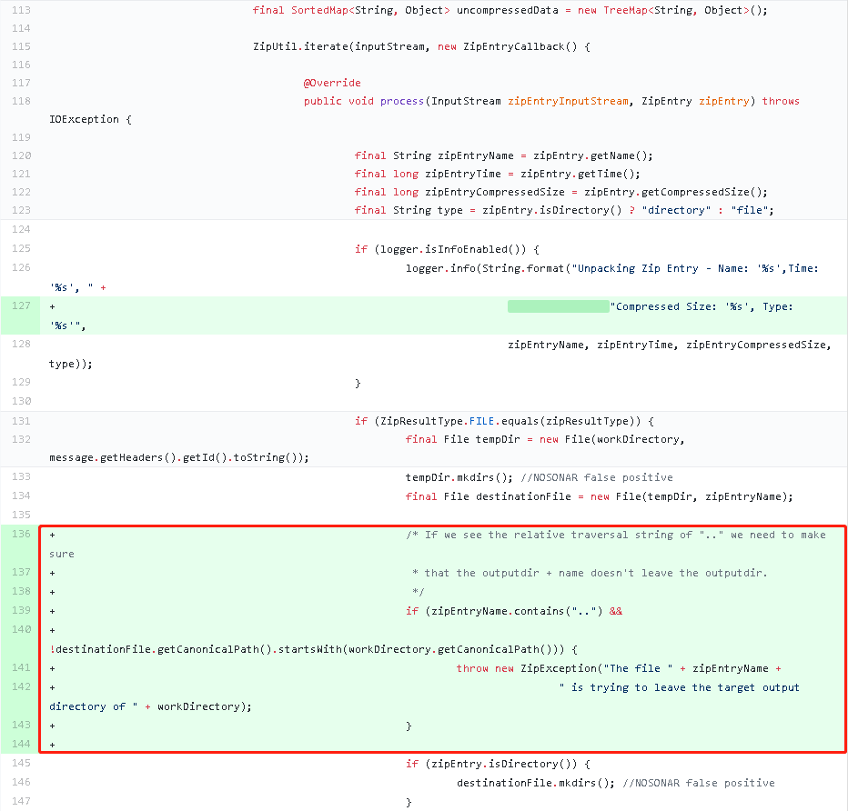
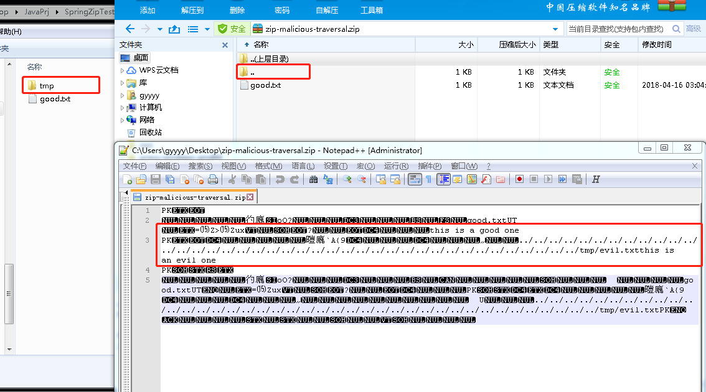
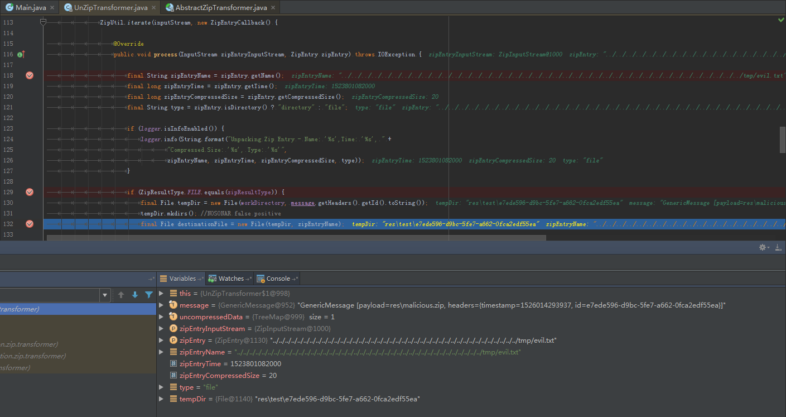
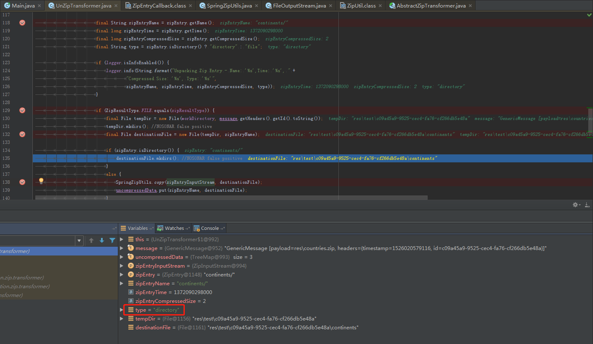
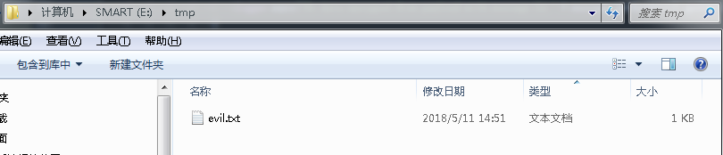
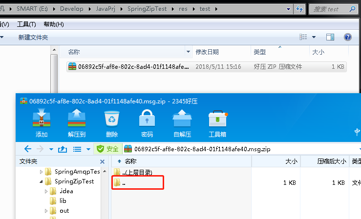
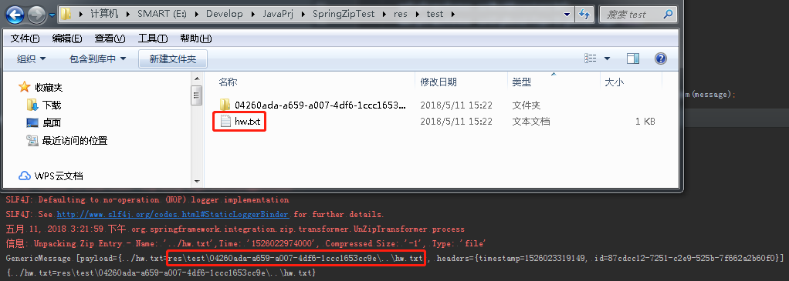

### 漏洞编号

CVE-2018-1261

### 漏洞信息

#### 漏洞等级

严重

#### 漏洞描述

在spring-integration-zip.v1.0.1.RELEASE之前的版本中，恶意用户通过在压缩文件中构造包含有特定文件名称的文件（受影响文件格式有bzip2, tar, xz, war, cpio, 7z），应用程序使用spring-integration-zip进行解压时，会导致跨目录任意写入文件漏洞的攻击。

攻击发生需要满足的条件：

1. 使用了spring-integration-zip库
1. 接收并解压了来自不可信来源的压缩文件

#### 受影响版本

1. spring-integration-zip.v1.0.0.RELEASE

#### 修复建议

- 升级至spring-integration-zip.v1.0.1.RELEASE或v1.0.2.RELEASE
- 不解压不可信的压缩文件

### 漏洞分析

#### 补丁对比



zip.v1.0.1.RELEASE在`UnZipTransformer`调用`ZipUtil.iterate()`时定义的回调中增加了一段对文件名称校验的代码片段_（在5月11日凌晨更新的zip.v1.0.2.RELEASE版本中，对`Byte[]`类型的分支逻辑也增加了文件名称校验，并且删除了对名称中`..`的判断，直接校验名称是否以工作区目录开头）_。

通过上述内容我们大致可以猜测这个漏洞的原理：攻击者可以通过构造一个包含名称带`../`前缀的文件的压缩包，使spring-integration-zip进行解压时该文件跳出解压目录被创建。

而且在zip.v1.0.1.RELEASE也增加了对这类压缩包的测试用例，并且十分贴心的附上了一个『恶意』的压缩包测试文件zip-malicious-traversal.zip。

我们先看看这个压缩包长什么样子：



稍微说明一下：

- 右上，压缩包正常打开的目录结构
- 右下，压缩包的文本形式数据
- 左，压缩包解压后的目录结构

从文本数据中不难看出，这个压缩包中存在一个以很多`../`开头为名称的文件evil.txt。以压缩工具打开查看时，它以目录树形式显示，而解压后最深层的有效目录及文件被提取至根目录_（说明使用的这个工具不存在这类解压漏洞）_。

这样就可以很清楚的知道，这个压缩包如果被zip.v1.0.0.RELEASE解压，evil.txt文件将会被写入工作区目录对应盘符下的tmp目录中。

搭个调试环境跑起来看看。

#### 环境搭建

1. IDE：IDEA
1. JDK：1.7
1. Libraries
    - spring-integration-zip.1.0.0.RELEASE
    - spring-integration-core.4.3.10.RELEASE
    - spring-integration-file.4.3.10.RELEASE
    - zt-zip.1.11

关键代码如下_（参考官方测试用例即可）_：

```java
    final UnZipTransformer unZipTransformer = new UnZipTransformer();
    unZipTransformer.setWorkDirectory(workDir);
    unZipTransformer.setZipResultType(ZipResultType.FILE);
    unZipTransformer.afterPropertiesSet();

    final Message<File> message = MessageBuilder.withPayload(inputFile).build();

    unZipTransformer.transform(message);
```

#### 流程跟踪

流程很简单，示例中的`UnZipTransformer.transform()`会调用`doZipTransform()`解压，在遍历压缩包内目录及文件时，回调`ZipEntryCallback.process()`对其进行处理。

当遍历到evil.txt时，它被识别为一个文件，而并不是多层的目录结构，那一堆乱七八糟的只是它的文件名：



而对正常压缩包遍历到目录时应该是这样的：



然后根据文件名在工作区目录中创建对应文件_（子目录会在遍历时被提前创建）_，并调用org.apache.commons.io包中的`IOUtils.copy()`复制文件数据。

此时，解压的文件名被转换为绝对路径：


程序运行结束，查看E:\tmp\目录下发现evil.txt文件_（由于Win操作系统默认没有/tmp目录，因此我在测试前提前创建了一个，也可以直接使用已存在目录，如Web Root:P）_：



#### PoC生成

知道了漏洞原理后，我们比较好奇的是如何生成这种特殊的压缩文件，已知方法有_（如果有更方便的方法，请告诉我）_：

1. 用二进制数据构造符合压缩包数据结构的文件
1. 使用spring-integration-zip压缩

我们用方法2做个测试，关键代码如下：

```java
    final ZipTransformer zipTransformer = new ZipTransformer();
    zipTransformer.setWorkDirectory(workDir);
    zipTransformer.setBeanFactory(mock(BeanFactory.class));
    zipTransformer.afterPropertiesSet();

    final String stringToCompress = "Hello World";
    final String zipEntryFileName = "../hw.txt";
    final Message<String> message = MessageBuilder.withPayload(stringToCompress)
            .setHeader(ZipHeaders.ZIP_ENTRY_FILE_NAME, zipEntryFileName)
            .build();

    zipTransformer.transform(message);
```

运行看看效果：



再解压试试：



可以看到hw.txt跳出解压目录外层来了，OK，打完收工。

### 参考

1. [CVE-2018-1261](https://pivotal.io/security/cve-2018-1261)
1. [Spring Integration Extensions](https://github.com/spring-projects/spring-integration-extensions/)