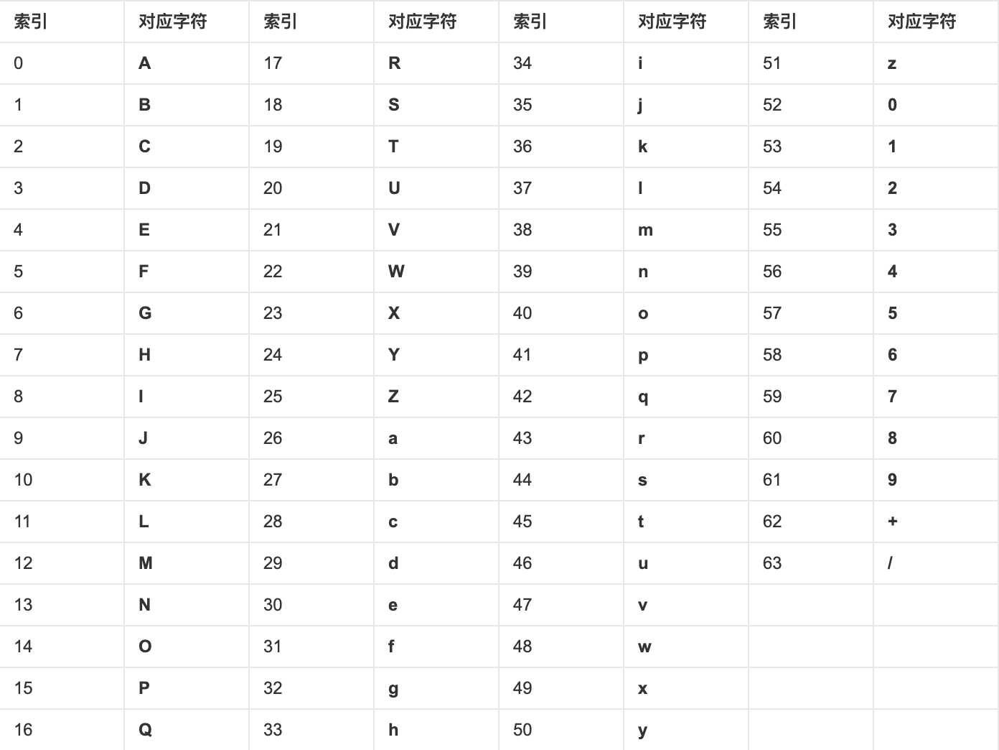

# 带你学加密之Base64

* 前两天，某OA的RCE在圈子里炒的风风火火，在被公开的PoC的请求数据中，有一种比较怪异的编码，后来被大佬们审计出来是厂商自定义码表的Base64。Base64是一种非常简单而且流行的编码方式，今天就带大家来实现一个口算Base64的小目标。

## Base64基础

Base64，顾名思义，就是基于大小写英文字母、数字，以及`+`和`/`共64个字符对任意字节数据进行表示的编码算法，通常用于文本协议中二进制数据传输的场景。

它的大家族中还有Base2、Base10、Base16、Base32、Base58，以及Base62x，它们本质都是码表映射。

我们今天的主角是Base64。

### 计算过程

如果要用一句话概括Base64算法，那就是把3个字节扩充为4个字节与码表进行映射，最后再加上原始数据长度除以3的余数个补位字符。

举个简单的例子，假设原始数据为`gyyyy`，转成字节数组是`103 121 121 121 121`。

我们将它按6bit一组进行分组，对每组的高位补`0`，也就是说原来的3个字节将会被扩充至4个 _（24+(2*4)，共32bit，这也是为什么Base64编码数据的长度会是原始数据的4/3倍）_。

以开头3个字节`103 121 121`为例，扩充过程如下表：

<table>
  <tr>
    <th>文本</th>
    <th colspan="8">g</th>
    <th colspan="8">y</th>
    <th colspan="8">y</th>
  </tr>
  <tr>
    <td>ASCII</td>
    <td colspan="8">103</td>
    <td colspan="8">121</td>
    <td colspan="8">121</td>
  </tr>
  <tr>
    <td>二进制位</td>
    <td>0</td>
    <td>1</td>
    <td>1</td>
    <td>0</td>
    <td>0</td>
    <td>1</td>
    <td>1</td>
    <td>1</td>
    <td>0</td>
    <td>1</td>
    <td>1</td>
    <td>1</td>
    <td>1</td>
    <td>0</td>
    <td>0</td>
    <td>1</td>
    <td>0</td>
    <td>1</td>
    <td>1</td>
    <td>1</td>
    <td>1</td>
    <td>0</td>
    <td>0</td>
    <td>1</td>
  </tr>
  <tr>
    <td>分组扩充</td>
    <td colspan="6">[00]011001</td>
    <td colspan="6">[00]110111</td>
    <td colspan="6">[00]100101</td>
    <td colspan="6">[00]111001</td>
  </tr>
</table>

将剩余字节也进行相同操作，得到的新字节数组用10进制表示为`25 55 37 57 30 23 36`。

这里，会有细心的同学发现，最后一个字节`121`在分组时，最后一组将只剩下4bit的`1001`，处理方法就是对低位也用`0`补齐至6bit长度即可。

### 码表映射

接下来的工作就太简单了，拿着每个字节在码表中找到相应的字符就行。标准码表如下：

这样我们就能很容易的拼接出编码后的字符串为`Z3l5eXk`。

结束了？当然没有，码表中还隐藏着第65个编码字符`=` _（开玩笑，别当真）_ 。它的作用是当原始数据长度不是3的倍数时，追加在编码字符串之后作为补位字符的。

已知`gyyyy`的长度是5，模3余1，因此需要在编码字符串后面追加1个`=`，最终得到的Base64编码字符为`Z3l5eXk=`。

## 某OA中的Base64

在了解完Base64算法之后，我们反观某OA的这个RCE漏洞的PoC中那些奇怪的字符串，存在几个有意思的特征：

1. 多个结尾处出现`6`或`66`，与Base64中的`=`和`==`一致
1. `FILENAME`开头出现连续的`qfTd`，猜测可能是重复的3个字符，如`../`或`..\`

因此，可以推断它们都是经过了自定义码表映射的特殊Base64字符串。

综合Base64基础知识，再重新仔细的分析一下每个变量的值：

1. `DBSTEP`的值长度为8，原值长度即为6，键名长度刚好也是6
1. `CREATEDATE`的值长度为16，2个补位字符，原值长度即为10，`0000-00-00`的长度就是10
1. `needReadFile`的值长度为8，1个补位字符，原值长度即为5，从键名来看是个标识符，除了`false`还能有谁？
1. `originalCreateDate`的值长度为20，2个补位字符，原值长度即为13，秒级时间戳是10位，那毫秒级呢？

这样一来，即便是我们在没有拿到源码的情况下，也可以综合圈子里给出的各种信息逆出一部分码表字符。

比如`originalFileId`的值`wV66`其实就是`MQ==`，也就是`1`了。

其他的还用说什么呢，自己玩去吧;)。

## 参考

1. [Base What? A Practical Introduction to Base Encoding](https://code.tutsplus.com/tutorials/base-what-a-practical-introduction-to-base-encoding--net-27590)