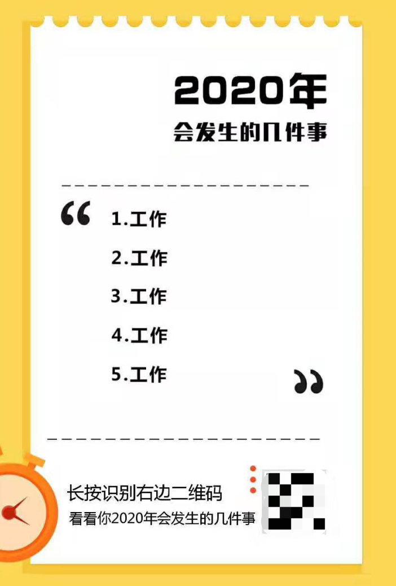

# 一次恶意重定向分析


<sub>* 在之前介绍RC4加密算法的文章中，提到了有一段神秘的JavaScript脚本，现在，就跟着我一起来还原它的全貌吧。 **免责声明：本文内容仅用于学习研究，所有代码片段都经过拆分简化，若私自滥用对他人或企业造成损失的，作者本人及所在公司概不负责。** </sub>

## 神秘代码初现

先给大家讲一个小故事：

> 眼瞅着就要过年了，朋友圈里也刮起了一股总结和预测的风。
>
> 其中，有个叫『2020年会发生的几件事』的图片分享，传播范围横跨了我朋友圈中好几个行业，势头强劲 *（当然，现在已经玩脱了）* 。
>
> 操作很简单，扫一扫二维码，点击预测，长按分享。大概长这样：



> 尼玛全是工作，这要被领导看见了还能放过我？不行，必须返回重测一遍。
>
> 第一次返回，跳到一个广告页，还好，习惯了，都是为了生存嘛。
>
> 第二次，广告，第三次，广告，没完了还？第四次，其他公众号文章，终于有点变化了。
>
> 直到第十次，都是各种类型的公众号文章，这推广做的也太暴力了吧……
>
> 我特么还不信出不去了，祭出我280的APM，大拇指都按断了，还是没出去。
>
> 算了，谁让我穷的用不起IPhone和高端Android，左上角叉掉吧。
>
> 冷静下来仔细想想，刚才还挺刺激的，索性把活动链接复制出来再搞搞。
>
> 手机浏览器打开，疯狂返回，出不去，但是感觉有点不太一样。PC浏览器打开，返回，出去了？？？
> 
> 有点意思。

看到这玩意，我的第一反应是可以模仿它的原理写一个实验室公众号技术文章历史盘点，随机无限看文章看到吐。毕竟年底了嘛，弄个小东西放给大家该多喜庆 *（想归想，但千万别真写，不然被腾讯爸爸封了可就亏大了）* 。

所以我们刨去前面的几个小广告，只看后面那一堆跳来跳去的公众号文章是怎么玩的。

手机抓包，拿到跳转公众号文章前的一段HTML，其中包含两坨加了密的JavaScript脚本：


游戏开始。

## SoJSON解密

既然要弄清楚原理，第一件事当然最好还是把它源代码里的JavaScript脚本给解成明文了。

老司机们看到上面的截图基本上就能确定它是用SoJSON加了密，网络上有很多在线解密，直接扔进去就行。

不过我今天心情不错，可以带大家简单的手工解一下，但是为了表示对作者免费精神的尊重，我们点到即止，不做深入讨论。

这个加密很简单，主要就做了6件事：

1. 将字符串拼接和函数调用等用函数表示，如`function(a, b){return a + b;}`和`function(a, b){return a(b);}`
1. 用`while`嵌套`switch`打乱原始逻辑执行顺序
1. 根据JavaScript的语言特性，将方法调用改为`[]()`形式，目的是尽量用字符串来表示方法名
1. 把所有字符串加密放进一个数组中，用该数组对应索引的引用替换原始字符串，并偏移数组元素的原始位置
1. 将数字全部转换成16进制表示，`true`用`!![]`表示
1. 变量名无意义化

现在，让我们一起来看看应该如何还原它。

代码中最开始会定义一个字符串数组，里面初始化了一堆长得像Base64的密文 *（直接解码当然是解不开的）* ，然后是一个以该数组为参数的自执行函数，不停的循环弹出压入元素：

```js
var __0x62ce8 = [...];
(function(_0x4b208f, _0x58ed6e) {
    var _0x35daa3 = function(_0x2fec43) {
            while (--_0x2fec43) {
                _0x4b208f['push'](_0x4b208f['shift']());
            }
        };
    _0x35daa3(++_0x58ed6e);
}(__0x62ce8, 0xfc));
```

其中，最令人费解的可能就是这个循环到底在干啥。

如果你仔细的看完了上面关于这个加密的介绍，里面有提到过它会对数组元素位置进行偏移，那么这个循环其实就是在校正它的原始位置。

再往下是一个篇幅比较大的公共函数，用来对数组中那堆密文进行解密，其实就是我[上篇文章](crypto-rc4.md)介绍过的RC4，这里不再展开。

跳过字符串解密和替换，就到了用户代码部分。以待解密的目标代码中一个实际函数为例，它首先会定义一个对象，里面填充了一些字符串和函数 *（同一段代码加密结果会不一样，是随机的）* ：

```js
var _0x2f5f94 = {
    'QPVDu': '5|0|4|3|2|1',
    'MdqhV': '\$&',
    'qDZxy': function _0x209aba(_0x1fba7b, _0x19b6c1) {
        return _0x1fba7b(_0x19b6c1);
    },
    'zGQHn': function _0x1c2e2b(_0x4fd03f, _0x138002) {
        return _0x4fd03f + _0x138002;
    },
    'VRXyy': function _0x535733(_0x35593c, _0x15967d) {
        return _0x35593c + _0x15967d;
    },
    'zSOyV': '(=([^&#]*)|&|#|$)'
};
```

然后是逻辑部分，它会调用上面这个对象中的属性，我们一并替换，得到个这玩意：

```js
var _0x1453d2 = '5|0|4|3|2|1'.split('|'),
    _0x259259 = 0;
while (true) {
    switch (_0x1453d2[_0x259259++]) {
        case '0':
            _0x2ffcf3 = _0x2ffcf3['replace'](/[\[\]]/g, '\$&');
            continue;
        case '1':
            return decodeURIComponent(_0x438a5d[2].replace(/\+/g, ' '));
        case '2':
            if (!_0x438a5d[2]) return '';
            continue;
        case '3':
            if (!_0x438a5d) return null;
            continue;
        case '4':
            var _0x473068 = new RegExp('[?&]' + _0x2ffcf3 + '(=([^&#]*)|&|#|$)'),
                _0x438a5d = _0x473068.exec(_0x37fcb2);
            continue;
        case '5':
            var _0x37fcb2 = window.location.href;
            continue;
    }
    break;
}
```

很明显，这个`'5|0|4|3|2|1'`其实就决定了循环中的执行顺序。简单整理下，一个根据名称获取URL中Query参数值的函数就被还原了：

```js
var href = window.location.href; // 5
param = param.replace(/[\[\]]/g, '\\$&'); // 0
var reg = new RegExp('[?&]' + param + '(=([^&#]*)|&|#|$)'), // 4
    arr = reg.exec(href);
if (!arr) return null; // 3
if (!arr[2]) return ''; // 2
return decodeURIComponent(arr[0x2].replace(/\+/g, ' ')); // 1
```

在完全解密还原后，发现它第一段脚本就是在对当前客户端平台进行判断：

```js
var iphone = navigator.platform.indexOf('iPhone') === 0;
var android = navigator.platform.indexOf('Linux') === 0
    || navigator.platform.indexOf('Linux armv7l') === 0
    || navigator.platform.indexOf('Linux aarch64') === 0;
var plat = iphone || android;
var ua = /micromessenger/.test(navigator.userAgent.toLowerCase());
if (!ua || !plat) {
    location.href = ...;
}
```

原来第二段才是重点。

## 执行过程分析

为了方便大家理解，我们将整个关键执行逻辑拆分成三个场景来分析。

### 首次访问

既然要跳转，首先需要有跳转目标的URL。

由于History不会重新加载，因此脚本通过`LocalStorage`机制进行存取。第一次访问是取不到值的，于是先要加载跳转目标：

```js
function load() {
    var elem = document.createElement('script');
    elem.setAttribute('src', '...');
    document.head.appendChild(elem);
}

var urls = localStorage.getItem('urls');
if (!urls) {
    load();
}
```

利用`script`标签进行远程加载，拿到另一段JavaScript代码并解析执行：

```js
var urls = [...];
localStorage.setItem('urls', JSON.stringify(urls));
jump();
```

### 文章内返回

当从公众号文章回退到当前页面时，`urls`当然已经可以正常取值了，直接跳转：

```js
urls = JSON.parse(urls);
jump();
```

### 疯狂返回

为了让用户能够一直停留在当前页面，脚本中利用URL中一个叫Hash *（不清楚的同学请百度）* 的东西，在每次执行当前页面脚本时，都把一个以上带不同Hash的URL压进去History：

```js
function push() {
    var t = new Date().getTime();
    var url = window.cururl + '#' + t;
    history.pushState(history.length + 1, 'xxx' + t, url);
}

window.cururl = location.href;
push();
```

这样，当用户疯狂返回时，其实仍然在当前页面的URL中。再利用`window.onhashchange`事件触发跳转，跳转前补充一个被消耗掉的History：

```js
window.onhashchange = function () {
    push();
    jump();
};
```

### 跳转

跳转前，先从`LocalStorage`中获取当前应该跳转目标的索引，取出对应的URL：

```js
var curr = localStorage.getItem('curr');
if (curr == null) {
    curr = 0;
}
var url = null;
if (curr < urls.length) {
    url = urls[curr];
}
```

终于要跳转了。

利用`a`标签的`noreferrer`属性删除引用信息，然后直接`click()`：

```js
var elem = document.createElement('a');
elem.setAttribute('rel', 'noreferrer');
elem.setAttribute('id', 'm_noreferrer');
elem.setAttribute('href', url);
document.body.appendChild(elem);
document.getElementById('m_noreferrer').click();
document.body.removeChild(elem);
```

打完收工。

## 效果演示

不得不说，这些黑帽的思路真骚，用户体验一流：


## 参考

1. [SoJSON在线加密](https://www.sojson.com/jsobfuscator.html)